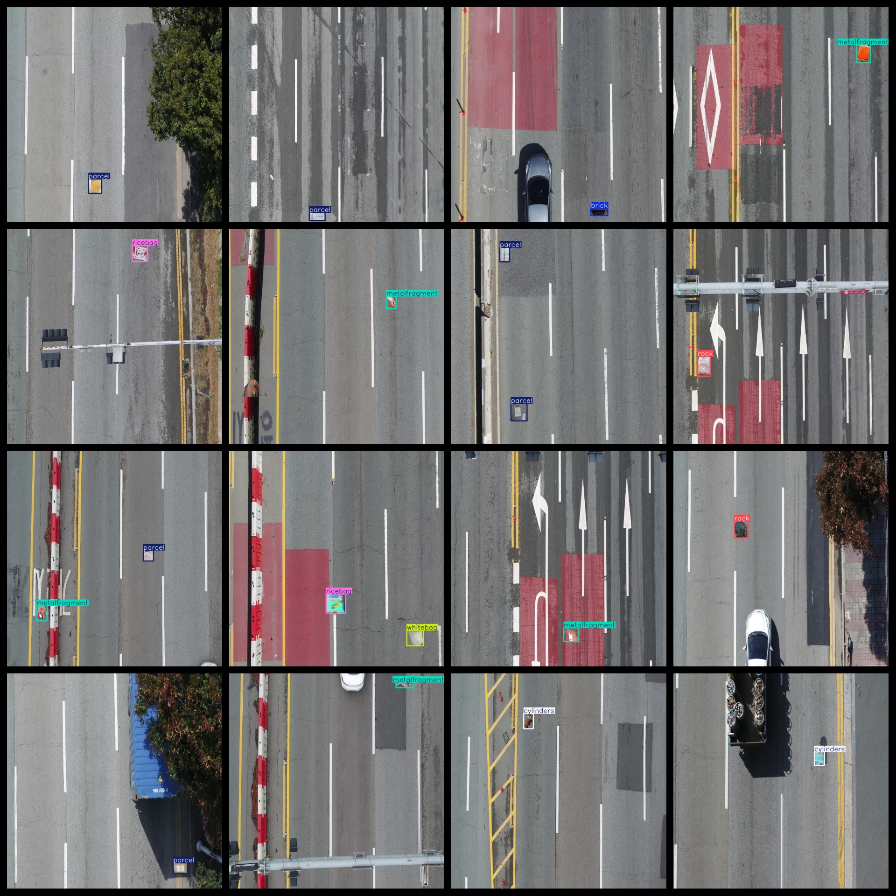
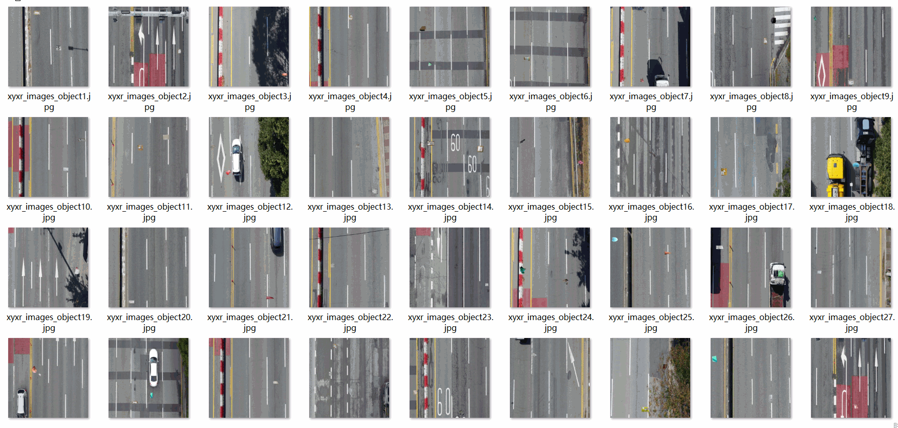

# UAV View Aerial Road Spilled Objects Dataset is a dataset containing 2804 images in the VOC+YOLO format (image synthesis).

The UAV View Aerial Road Spilled Objects Dataset consists of 2804 images in the VOC+YOLO format (image synthesis).

Dataset Format: Pascal VOC format + YOLO format (without split path in txt file, only contains jpg images and corresponding VOC format xml files and yolo format txt files).

Dataset Explanation: The road spilled objects dataset is presented via PS image form, placing 8 types of spilled objects on the road surface during aerial photography. Please read carefully before purchasing.

Number of Images (jpg File Count): 2804

Number of Annotations (xml File Count): 2804

Number of Annotations (txt File Count): 2804

Number of Annotation Categories: 8

Repository: datasets_sl

Annotation Category Names (Note that the order of categories in the yolo format does not correspond to this, but rather to the labels folder classes.txt): ["brick", "bucket", "cylinders", "metalfragment", "parcel", "ricebag", "rock", "whitebag"]

Label Chinese Translations: Brick, bucket, cylinders, metal fragment, parcel, ricebag, rock, white bag

Number of Boxes per Classification:

brick boxes = 134

bucket boxes = 75

cylinders boxes = 182

metalfragment boxes = 1327

parcel boxes = 1371

ricebag boxes = 149

rock boxes = 543

whitebag boxes = 260

Total Boxes: 4041

Number of Pictures per Classification:

brick pictures = 133

bucket pictures = 75

cylinders pictures = 181

metalfragment pictures = 1200

parcel pictures = 1232

ricebag pictures = 147

rock pictures = 523

whitebag pictures = 253

Image Resolution: 640x640

Using Annotation Tool: labelImg

Dataset Augmentation: No

Annotation Rules: Draw rectangular boxes for categories

Important Notice: The dataset does not have separate training, validation, or test sets; you need to partition them yourself.

Special Remark: This dataset does not guarantee any accuracy of the trained model or weight files.

Annotation and Image Details:

## Images

---

Here is a pay link on Stripe (https://buy.stripe.com/3cs8yP7sY87d0vu9AB). Please contact me lonlonago@foxmail.com after funding $89, and I will send you a complete data files, thank you!

